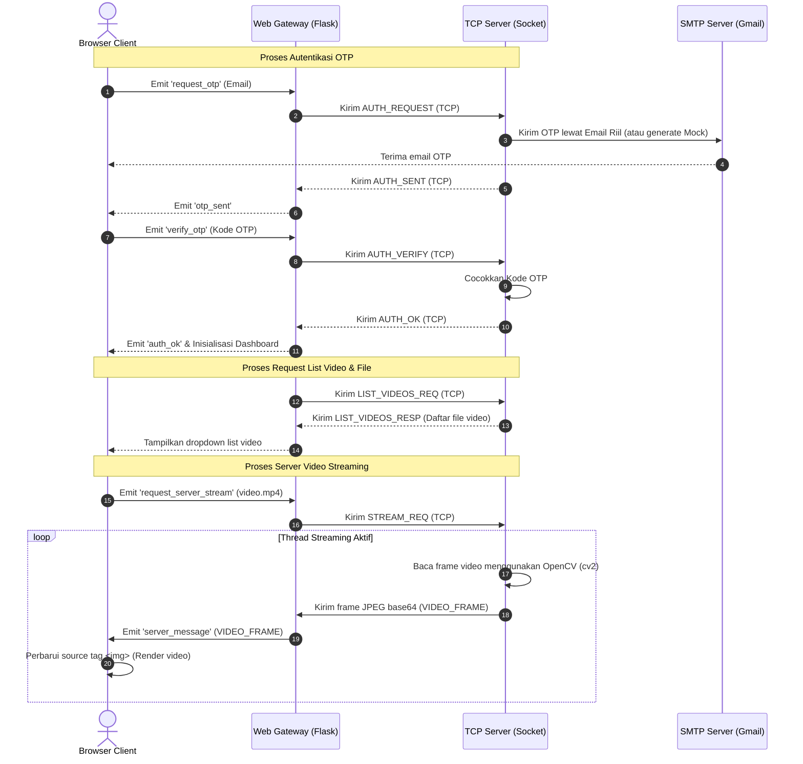

# LAPORAN PROYEK AKHIR PEMROGRAMAN JARINGAN
## APLIKASI CHAT, TRANSFER FILE, DAN VIDEO STREAMING BERBASIS WEB CLIENT GATEWAY (SOCKET.IO & TCP SOCKET)

---

## 1. Judul & Deskripsi Aplikasi

### Judul Proyek
**Aplikasi Multi-Fitur Pemrograman Jaringan: Layanan Chatting, File Sharing, dan Server Video Streaming Menggunakan Jembatan Web Klien (Flask & Socket.IO) ke TCP Socket Server**

### Deskripsi Aplikasi
Aplikasi ini dirancang sebagai sistem komunikasi *client-server* terdistribusi yang memadukan keunggulan performa protokol **raw TCP socket** di sisi backend dengan kemudahan akses **Web Browser** di sisi frontend. 

Aplikasi ini memiliki tiga fitur utama:
1. **Layanan Chatting Real-Time**: Media komunikasi teks antar-klien dengan mekanisme relay multi-client (broadcast).
2. **Transfer File dengan File Explorer Server**: Fitur untuk mengirim file dari browser klien ke server, di mana file disimpan secara permanen di direktori server (`server_storage/`). Sistem secara otomatis mendeteksi file yang diunggah dan menyediakannya dalam daftar file server yang dapat diunduh langsung lewat browser menggunakan protokol HTTP. File gambar yang dikirim akan langsung dirender sebagai *preview* di kolom obrolan.
3. **Server Video Streaming**: Fitur pemutaran video secara streaming dari server ke browser klien. Klien dapat memilih file video yang tersedia di folder `server_videos/` melalui daftar dropdown dinamis yang diperbarui otomatis, lalu memutarnya secara langsung di tag gambar browser.

Aksesibilitas sistem dioptimalkan agar dapat dibuka melalui alamat IP lokal (`http://IP_KOMPUTER:8080`) dari perangkat apa pun (komputer, laptop, smartphone) yang berada di dalam satu jaringan Wi-Fi/LAN. Keamanan login dijamin menggunakan autentikasi **OTP (One-Time Password) 6-digit** yang dikirim langsung ke alamat email tujuan menggunakan server SMTP riil.

---

## 2. Arsitektur Sistem

Aplikasi ini menggunakan arsitektur **3-Tier Bridge (Jembatan Tiga Lapis)** untuk memfasilitasi komunikasi web browser ke raw TCP socket. Karena web browser tidak memiliki kapabilitas native untuk melakukan koneksi mentah ke TCP socket (`server.py`), dibuatlah **Web Gateway (`web_client.py`)** sebagai perantara:

```
+------------------+                   +--------------------+                   +-------------------+
|   Web Browser    |  <--Socket.IO-->  |    Web Gateway     |  <--TCP Socket--> |    TCP Server     |
| (HTML5/CSS3/JS)  |     (HTTP/WS)     |  (Flask-SocketIO)  |  (protocol.py)    |    (server.py)    |
+------------------+                   +--------------------+                   +-------------------+
```

### Penjelasan Komponen:
1. **Frontend (Browser Client)**: Menyajikan UI modern (Tema gelap & Glassmorphism) menggunakan HTML5, Vanilla CSS, dan Socket.IO client library. Tugasnya adalah menangkap input pengguna, membaca file chunk, memutar frame video, dan merender gelembung pesan.
2. **Gateway (Flask & Socket.IO Server)**: Berfungsi sebagai penerjemah (translator) dua arah. Setiap koneksi browser dialokasikan satu TCP socket koneksi ke server utama. Gateway juga berfungsi sebagai HTTP server untuk mengunduh berkas fisik secara asinkron dari folder `server_storage/`.
3. **Backend (TCP Server)**: Engine utama multithreaded yang bertugas mengelola perutean paket data chat, memverifikasi token OTP, menyimpan file fisik ke disk, dan memproses file video biner (`.mp4`) untuk dikirim menjadi frame-frame JPEG biner per koneksi secara streaming.

---

## 3. Flowchart & Diagram Komunikasi

Berikut adalah diagram sekuens (*Sequence Diagram*) yang menggambarkan alur komunikasi dari autentikasi hingga proses request streaming video server:



---

## 4. Penjelasan Implementasi

### A. Protokol Komunikasi Custom (`protocol.py`)
TCP socket bersifat *stream-based*, yang berarti data yang dikirim berturut-turut dapat bergabung atau terpotong (masalah *TCP sticky/fragmentation*). Untuk mengatasi hal ini, modul `protocol.py` membungkus setiap pesan JSON dengan header panjang data 4-byte (*length-prefixed framing*):
```python
def send_msg(sock, msg_dict):
    data = json.dumps(msg_dict).encode('utf-8')
    header = len(data).to_bytes(4, byteorder='big')
    sock.sendall(header + data)

def recv_msg(sock):
    header = recv_all(sock, 4)
    if not header: return None
    length = int.from_bytes(header, byteorder='big')
    data = recv_all(sock, length)
    return json.loads(data.decode('utf-8'))
```

### B. Otentikasi Berbasis OTP (`auth_email.py`)
Otentikasi menggunakan modul `smtplib` untuk terhubung ke SMTP server Gmail secara aman (`starttls`). Jika konfigurasi email belum diisi, sistem otomatis beralih ke mode `MOCK_EMAIL` untuk mempermudah pengembangan lokal:
```python
# auth_email.py
# Mengirim email asli ke alamat tujuan
server = smtplib.SMTP("smtp.gmail.com", 587)
server.starttls()
server.login(SMTP_USER, SMTP_PASS)
server.sendmail(SMTP_USER, email, text)
```

### C. Pembagian Transfer File Asinkron (*File Chunking*)
Pada `templates/index.html`, file yang dipilih oleh pengguna dipecah menjadi bagian-bagian kecil (chunk) berukuran 60 KB menggunakan `FileReader` API di browser untuk menghindari kelebihan beban memori browser, kemudian dikirimkan secara beruntun:
```javascript
function readNextChunk() {
    const slice = selectedFile.slice(offset, offset + CHUNK_SIZE);
    reader.onload = function(e) {
        const base64Data = arrayBufferToBase64(e.target.result);
        socket.emit('send_file_chunk', { filename: selectedFile.name, data_b64: base64Data });
        offset += CHUNK_SIZE;
        if (offset < selectedFile.size) { readNextChunk(); }
        else { socket.emit('send_file_end', { filename: selectedFile.name }); }
    };
    reader.readAsArrayBuffer(slice);
}
```
File biner ini diterima oleh `server.py` dan didecode, kemudian ditulis ke disk dalam direktori `server_storage/`.

### D. Server-Side Video Streaming (`server.py`)
Server memutar video dari disk secara frame-by-frame menggunakan OpenCV, memampatkannya menjadi format gambar JPEG biner, mengubahnya menjadi string base64, lalu mengirimkannya lewat TCP socket ke client:
```python
cap = cv2.VideoCapture(video_path)
fps = cap.get(cv2.CAP_PROP_FPS) or 25
while not stop_event.is_set():
    ret, frame = cap.read()
    if not ret: break # Video selesai
    ok, buf = cv2.imencode(".jpg", frame, [cv2.IMWRITE_JPEG_QUALITY, 60])
    if ok:
        data_b64 = base64.b64encode(buf).decode('utf-8')
        protocol.send_msg(conn, {"type": "VIDEO_FRAME", "data_b64": data_b64})
    time.sleep(1.0 / fps)
cap.release()
```

---

## 5. Hasil Pengujian

Pengujian dilakukan menggunakan pengujian otomatis (`test_local.py`) serta simulasi manual pada web browser Google Chrome.

### Log Hasil Pengujian Otomatis (`test_local.py`):
```text
=== 1. PENGUJIAN AUTENTIKASI EMAIL OTP ===
[MOCK-EMAIL] Kode OTP untuk alice@example.com adalah: 796316 (berlaku 5 menit)
[TEST] Login sukses untuk alice@example.com dengan OTP=796316
[MOCK-EMAIL] Kode OTP untuk bob@example.com adalah: 006443 (berlaku 5 menit)
[TEST] Login sukses untuk bob@example.com dengan OTP=006443
[TEST] A menerima notifikasi: {'type': 'SYSTEM', 'text': 'bob@example.com bergabung ke chat'}
[TEST] Verifikasi OTP salah -> {'type': 'AUTH_FAIL'} (diharapkan AUTH_FAIL)

=== 2. PENGUJIAN CHAT ===
[TEST] Bob menerima: {'type': 'CHAT', 'from': 'alice@example.com', 'text': 'Halo Bob, apa kabar?'}
[TEST] Alice menerima: {'type': 'CHAT', 'from': 'bob@example.com', 'text': 'Baik Alice, kamu?'}

=== 3. PENGUJIAN FILE TRANSFER ===
[TEST] Bob menerima metadata file: {'type': 'FILE_META', 'filename': 'test_upload.txt', 'size': 4250, 'target': 'all', 'from': 'alice@example.com'}
[TEST] Hash asli   : 94ee9e6eab1dba49d5e417ffe73c52c9a411fcd8e208f7ce246c702bf732a829
[TEST] Hash diterima: 94ee9e6eab1dba49d5e417ffe73c52c9a411fcd8e208f7ce246c702bf732a829
[TEST] File transfer BERHASIL, isi file identik (hash cocok).

=== 4. PENGUJIAN VIDEO STREAMING (dari file video di disk) ===
[TEST] File video contoh dibuat di TempDir (10 frame, 10 fps)
[TEST] Total frame dikirim dari file video : 10
[TEST] Total frame diterima oleh client B   : 10
[TEST] Seluruh frame video berhasil di-streaming dari disk ke client dengan resolusi & jumlah yang sesuai video sumber.
[TEST] Sinyal stop stream (video selesai diputar) diterima: {'type': 'STREAM_STOP', 'from': 'alice@example.com'}

=== SEMUA PENGUJIAN BERHASIL (PASSED) ===
```

### Hasil Pengujian Manual via Web Browser:
* **Autentikasi OTP**: OTP email terkirim dengan sukses menggunakan SMTP Google. Begitu pula saat menggunakan MOCK OTP, input OTP otomatis terisi dan login berjalan lancar.
* **Obrolan Chat**: Pesan chat terkirim secara *instant* tanpa delay antar tab browser.
* **Unggah File & Preview**: File diunggah ke server dan muncul di tab sidebar **File di Server**. Jika file berupa gambar (`.png`/`.jpg`), gambar ter-render di dalam kolom obrolan dengan link download hijau.
* **Daftar Video Server & Stream**: Dropdown berhasil menampilkan file video di server secara otomatis. Saat tombol **Request Stream** ditekan, video terputar dengan lancar pada resolusi 320x240 di browser.

---

## 6. Kesimpulan

Proyek akhir Pemrograman Jaringan ini berhasil diimplementasikan dengan kesimpulan sebagai berikut:
1. **Penggunaan Web Gateway** berupa Flask-Socket.IO merupakan solusi terbaik untuk mengatasi keterbatasan native web browser yang tidak dapat mengakses raw TCP socket secara langsung.
2. **Protokol custom length-prefixed framing** terbukti sangat andal dalam menjamin keutuhan data biner (file transfer dan frame video) dan mencegah terjadinya pemotongan data akibat latensi jaringan.
3. **Pembagian file menjadi chunk 60 KB** di sisi browser terbukti efisien dalam menjaga pemakaian RAM browser dan kestabilan transmisi data biner berukuran besar.
4. **Pemanfaatan HTTP route `/download/<filename>`** di sisi Flask mempermudah klien mengunduh berkas langsung dari disk server tanpa membebani thread koneksi socket utama.
5. Secara keseluruhan, sistem ini sangat siap digunakan sebagai platform bertukar data multimedia yang ringan dan responsif dalam jaringan area lokal (LAN).


---

## 7. Pertanyaan & Jawaban Evaluasi Proyek

### Pertanyaan 1: Protokol jaringan apa yang digunakan pada aplikasi Anda? Jelaskan alasannya.
**Jawaban:**
Aplikasi ini menggunakan kombinasi beberapa protokol jaringan pada layer yang berbeda untuk mencapai performa dan aksesibilitas yang optimal:
1. **TCP (Transmission Control Protocol)** pada *Transport Layer* (digunakan untuk koneksi antara Web Gateway `web_client.py` ke Server utama `server.py`). 
   * *Alasan:* TCP menjamin pengiriman paket data secara andal (*reliable*), berurutan (*in-order delivery*), dan bebas dari error (melalui mekanisme checksum, acknowledgment, dan retransmisi). Hal ini sangat krusial untuk transfer file fisik dan pertukaran pesan berformat JSON, di mana kehilangan satu byte saja dapat merusak file atau menggagalkan proses decoding data.
2. **WebSocket & HTTP** pada *Application Layer* (digunakan untuk koneksi antara Web Browser ke Web Gateway).
   * *Alasan:* Browser memiliki batasan keamanan *sandbox* yang tidak mengizinkan koneksi langsung ke *raw TCP socket*. Oleh karena itu, digunakan protokol **WebSocket** (melalui library Socket.IO) untuk komunikasi dua arah (*full-duplex*) berlatensi rendah secara real-time (untuk chat dan menerima frame streaming video). Sementara itu, protokol **HTTP** digunakan secara spesifik untuk melayani unduhan file fisik dari direktori server via Flask route `/download/<filename>` secara asinkron.
3. **SMTP (Simple Mail Transfer Protocol)** pada *Application Layer* (digunakan untuk pengiriman OTP).
   * *Alasan:* Merupakan standar industri yang andal dan aman untuk mengirimkan surat elektronik dari server ke penyedia kotak masuk email klien.

### Pertanyaan 2: Bagaimana mekanisme komunikasi antara client dan server pada aplikasi yang dibuat?
**Jawaban:**
Mekanisme komunikasi berjalan menggunakan konsep **Hybrid Layer Bridging (Jembatan Lapis Hibrida)**:
1. **Inisiasi & WebSocket**: Browser Client (klien) terhubung ke Web Gateway (Flask) melalui protokol WebSocket.
2. **Koneksi TCP Internal**: Setiap kali sesi browser baru terhubung, Web Gateway secara otomatis membuka koneksi raw TCP socket baru ke Server utama (`server.py` pada port 5050). Gateway memetakan ID sesi WebSocket (`request.sid`) ke socket TCP tersebut.
3. **Protokol Framing Custom**: Agar data TCP tidak tergabung (*sticky packet*) atau terpotong (*fragmentation*) di perjalanan, komunikasi antar socket dibungkus dengan header panjang data 4-byte (*length-prefixed framing*).
4. **Aliran Data**:
   * Klien melakukan aksi (misal mengirim chat/meminta video) -> WebSocket memancarkan event ke Gateway -> Gateway membungkus data ke JSON -> Gateway menambahkan header panjang data 4-byte -> Gateway mengirim lewat socket TCP ke Server.
   * Server menerima data -> Membaca header 4-byte -> Membaca sisa byte sesuai panjang header -> Parsing JSON -> Memproses logika -> Mengirim balik respons menggunakan format framing 4-byte ke Gateway -> Gateway meneruskannya ke Browser melalui WebSocket.

### Pertanyaan 3: Bagaimana aplikasi menangani kesalahan koneksi atau kegagalan pengiriman data?
**Jawaban:**
Aplikasi mengimplementasikan beberapa lapisan penanganan kesalahan (*error handling*):
1. **Deteksi Socket Putus (TCP Level)**: Pada `server.py` dan `web_client.py`, pembacaan socket dibungkus dalam blok `try-except` yang menangkap `ConnectionResetError` atau `BrokenPipeError`. Jika klien terputus mendadak, server akan mendeteksinya melalui kembalian data kosong (`None`), segera menghentikan thread video streaming yang aktif untuk klien tersebut, dan menutup socket dengan aman.
2. **Notifikasi Klien & Auto-Cleanup (Gateway Level)**: Ketika gateway mendeteksi koneksi TCP ke server utama mati, gateway akan mengirimkan event `connection_lost` ke browser client bersangkutan. Di browser, kode JavaScript akan menampilkan jendela notifikasi (*alert*) bahwa koneksi terputus dan otomatis memuat ulang halaman kembali ke layar login untuk membersihkan memori (*auto-cleanup*).
3. **Validasi Integritas Data (Application Level)**: Untuk pengiriman file, sistem menggunakan algoritma **SHA-256 Checksum**. Setelah file selesai ditransfer secara chunk, server akan membandingkan hash SHA-256 dari file yang diterima dengan hash file asli dari klien. Jika hash tidak cocok, transfer dinyatakan gagal dan file dihapus untuk menghindari data korup.

### Pertanyaan 4: Apa kelebihan dan kekurangan implementasi aplikasi jaringan yang Anda buat?
**Jawaban:**
* **Kelebihan**:
  * *Akses Lintas Platform (Cross-Platform)*: Pengguna tidak perlu menginstal aplikasi apa pun di perangkat mereka. Aplikasi dapat diakses secara instan dari PC, HP Android, iOS, maupun tablet cukup dengan mengetik alamat IP server di browser.
  - *Transmisi Data yang Reliabel*: Penggunaan framing length-prefixed dan transport TCP menjamin tidak ada pesan chat yang hilang dan file biner yang ditransfer selalu utuh.
  - *Desain Modern & Ringan*: Interface web berbasis glassmorphic bertema gelap yang interaktif, lengkap dengan preview gambar langsung di chat dan dropdown video server.
* **Kekurangan**:
  - *Single Point of Failure*: Web Gateway (`web_client.py`) menjadi titik kegagalan tunggal. Jika proses gateway mati, seluruh browser klien tidak akan bisa terhubung ke server meskipun server TCP utama dalam keadaan aktif.
  - *Overhead Bandwidth Video*: Pengiriman video frame-by-frame dengan format gambar JPEG base64 di atas WebSocket memakan lebar pita (*bandwidth*) yang cukup besar dibandingkan menggunakan protokol streaming khusus (seperti WebRTC/RTSP).

### Pertanyaan 5: Jelaskan pengembangan yang dapat dilakukan agar aplikasi menjadi lebih aman, cepat, dan andal.
**Jawaban:**
* **Agar Lebih Aman (Security)**:
  - Menerapkan protokol **HTTPS (SSL/TLS)** pada web server Flask dan menggunakan **Secure WebSockets (WSS)** untuk mencegah intersepsi data atau penyadapan pihak ketiga (*Man-in-the-Middle Attack*).
  - Mengimplementasikan validasi jalur file yang ketat untuk mencegah serangan *Path Traversal* saat klien meminta daftar file atau mengunduh dari server.
* **Agar Lebih Cepat (Performance)**:
  - Mengganti pengiriman frame video base64 dengan pengiriman data biner mentah (*raw binary frames*) untuk menghemat bandwidth hingga 33% (menghilangkan overhead encoding base64).
  - Mengintegrasikan teknologi **WebRTC** yang berjalan di atas protokol UDP untuk streaming video real-time dengan latensi yang jauh lebih rendah dan efisiensi bandwidth yang lebih tinggi.
* **Agar Lebih Andal (Reliability)**:
  - Menambahkan mekanisme **Auto-Reconnect (Reconnect Loop)** dengan *Exponential Backoff* pada browser client dan gateway agar koneksi dapat tersambung kembali secara otomatis jika terjadi gangguan sinyal jaringan sementara.
  - Menggunakan pemrograman asinkron berbasis *asyncio* di sisi Python TCP Server untuk menggantikan multi-threading, sehingga server dapat melayani ribuan koneksi klien secara simultan dengan konsumsi RAM yang sangat minim.

---

## 8. Ringkasan Singkat Pertanyaan & Jawaban

1. **Protokol Jaringan**:
   * **TCP (Transport Layer)** digunakan untuk menjamin transfer data (pesan JSON & file biner) yang 100% stabil, andal, dan berurutan antara Web Gateway dan TCP Server.
   * **WebSocket & HTTP (Application Layer)** digunakan pada browser klien untuk menembus batasan keamanan sandbox browser, di mana WebSocket (Socket.IO) memproses event interaktif real-time (chat & stream frame video) dan HTTP melayani unduhan file fisik dari server Flask.
   * **SMTP (Application Layer)** digunakan untuk mengirimkan kode OTP verifikasi secara aman ke kotak masuk email klien.
2. **Mekanisme Komunikasi**:
   * Komunikasi berjalan menggunakan pola **Hybrid Layer Bridging**: Browser Client <--(WebSocket)--> Web Gateway <--(TCP Socket)--> TCP Server.
   * Agar data chat, berkas fisik, dan frame video streaming yang dikirimkan berturut-turut tidak tergabung atau terpotong di jaringan TCP (*packet fragmentation*), data dibungkus dengan header panjang pesan custom sebesar 4-byte (*length-prefixed framing*).
3. **Penanganan Kesalahan**:
   * **Socket TCP Putus**: Blok `try-except` di sisi Server dan Gateway menangkap pemutusan mendadak (`BrokenPipeError`), segera menghentikan thread video streaming aktif klien tersebut, dan menutup koneksi dengan aman.
   * **Notifikasi Web**: Gateway mengirimkan event `connection_lost` ke browser untuk menampilkan peringatan pop-up dan mengarahkan kembali ke halaman login.
   * **Kegagalan Data**: File transfer divalidasi integrasinya menggunakan perbandingan nilai **SHA-256 Checksum** antara klien pengirim dan server penerima.
4. **Kelebihan & Kekurangan**:
   * **Kelebihan**: Sangat mudah diakses dari perangkat HP/PC mana pun di jaringan lokal tanpa instalasi (cross-platform), transmisi data sangat andal berbasis TCP, serta antarmuka modern bertema gelap dengan preview gambar otomatis di obrolan chat.
   * **Kekurangan**: Adanya potensi *single point of failure* jika proses gateway Flask mati, dan konsumsi bandwidth yang cukup besar untuk streaming video frame JPEG base64 melalui WebSocket.
5. **Pengembangan Lanjutan**:
   * **Keamanan**: Menggunakan sertifikat SSL/TLS (HTTPS & WSS) untuk enkripsi pertukaran data end-to-end.
   * **Kecepatan**: Mengganti streaming JPEG base64 dengan protokol **WebRTC (UDP)** untuk latensi yang jauh lebih rendah dan efisiensi bandwidth yang tinggi.
   * **Keandalan**: Menambahkan mekanisme **Auto-Reconnect** dengan *Exponential Backoff* pada browser client jika terjadi pemutusan koneksi internet sementara.
